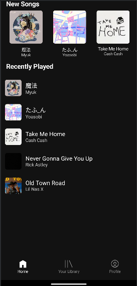
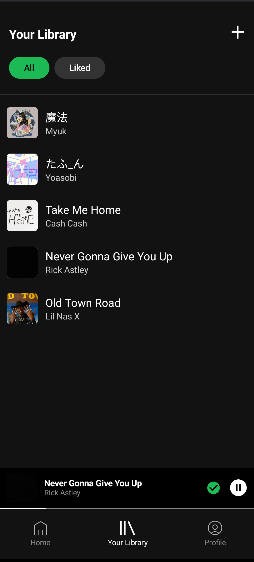
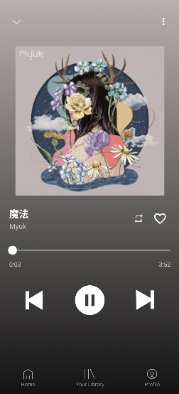
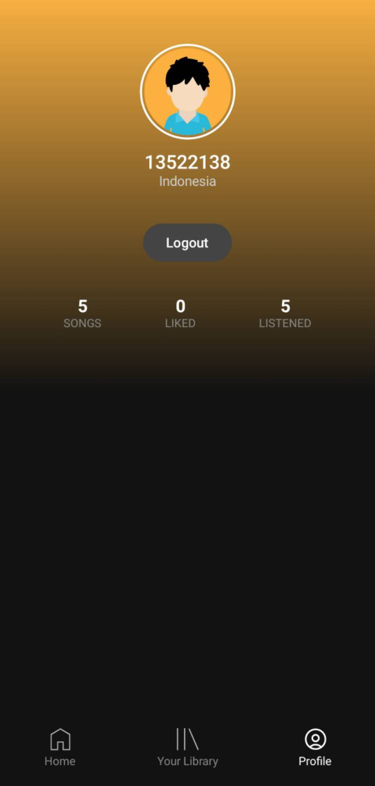
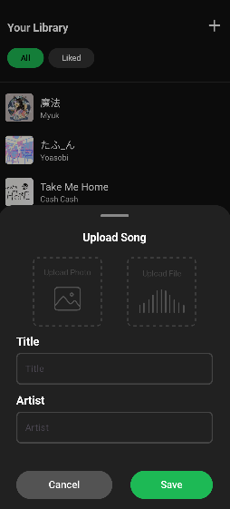
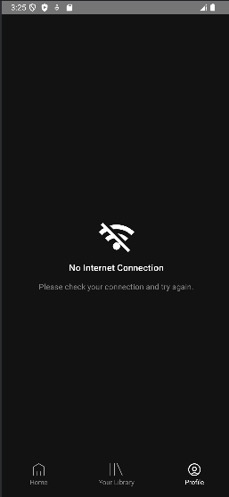

# if3210-tubes-mad-2025-if3210-2025-mad-kln

> Repository Tugas Besar 1 Mobile App Development 2025

 
Pada tugas besar 1, kami diminta untuk membuat sebuah aplikasi music player seperti Spotify menggunakan Android Native dengan bahasa Kotlin. Fitur utama dari aplikasi ini adalah login, home page, library page, music player page, dan profile page. Setiap fitur memiliki fungsionalitas yang berbeda, seperti pada halaman login, pengguna dapat masuk dengan akun mereka, sedangkan di halaman home, pengguna dapat melihat lagu terbaru. Di halaman library, pengguna bisa mengelola lagu favorit mereka, dan pada music player page, mereka dapat memutar, menjeda, dan mengontrol musik yang sedang diputar. Terakhir, di halaman profile, pengguna dapat melihat informasi mengenai akun mereka. Selain itu, aplikasi ini juga menyediakan fungsionalitas untuk mengunggah lagu, mencari lagu berdasarkan judul atau artist, serta menyimpan preferensi musik pengguna. 

## Spesifikasi

<table border="1">
  <tr>
    <td>Bahasa Pemrograman</td>
    <td>Kotlin (Android Native)</td>
  </tr>
  <tr>
    <td>Namespace</td>
    <td><code>com.android.purrytify</code></td>
  </tr>
  <tr>
    <td>compileSdk</td>
    <td>34</td>
  </tr>
  <tr>
    <td>applicationId</td>
    <td><code>com.android.purrytify</code></td>
  </tr>
  <tr>
    <td>minSdk</td>
    <td>29</td>
  </tr>
  <tr>
    <td>targetSdk</td>
    <td>34</td>
  </tr>
</table>

## Library Yang Digunakan

1. Library Inti Android  
   `androidx.core:core-ktx`
   `androidx.lifecycle:lifecycle-runtime-ktx`
   `androidx.activity:activity-compose`    
2. Jetpack Compose (UI Deklaratif Android)  
   `androidx.compose:compose-bom`
   `androidx.compose.ui:ui`
   `androidx.compose.ui:ui-graphics`
   `androidx.compose.ui:ui-tooling-preview`
   `androidx.compose.material3:material3`
   `androidx.navigation:navigation-compose`
   `androidx.compose.material:material-icons-extended`   
3. Accompanist (Tambahan untuk Compose)  
   `accompanist-systemuicontroller`
   `accompanist-navigation-animation`
   `androidx.palette:palette-ktx`    
4. RecyclerView & Material  
   `androidx.recyclerview:recyclerview`
   `androidx.cardview:cardview`
   `com.google.android.material:material`    
5. Room Database (Penyimpanan Lokal)  
   `androidx.room:room-runtime`
   `androidx.room:room-compiler`
   `androidx.room:room-ktx`    
6. Lifecycle & ViewModel  
   `androidx.lifecycle:lifecycle.viewmodel.android`
   `lifecycle-runtime-compose`
   `lifecycle-viewmodel-compose`
   `lifecycle-viewmodel-ktx`
   `lifecycle-livedata-ktx`    
7. Coroutines  
   `kotlinx-coroutines-core`
   `kotlinx-coroutines-android`    
8. Coil (Pemrosesan Gambar)  
   `coil-compose`   
9. Splash Screen  
   `core-splashscreen`    
10. Login dan Networking  
    `retrofit`
    `converter-gson`
    `okhttp3:logging-interceptor`
    `datastore-preferences`    

## Screenshot

<table style="width: 100%;" border="1">
    <tr>
        <th>No</th>
        <th>Halaman</th>
        <th>Screenshot</th>
         <th>No</th>
        <th>Halaman</th>
        <th>Screenshot</th>
    </tr>
    <tr>
        <td>1</td>
        <td>Splash</td>
        <td style="text-align: center;">
            
        </td>
        <td>2</td>
        <td>Login Page</td>
        <td style="text-align: center;">
            
        </td>
    </tr>
    <tr>
        <td>3</td>
        <td>Home Page</td>
        <td style="text-align: center;">
            
        </td>
        <td>4</td>
        <td>Library Page</td>
        <td style="text-align: center;">
            
        </td>
    </tr>
    <tr>
        <td>5</td>
        <td>Track View Page</td>
        <td style="text-align: center;">
            
        </td>
        <td>6</td>
        <td>Profile Page</td>
        <td style="text-align: center;">
            
        </td>
    </tr>
    <tr>
        <td>7</td>
        <td>Upload Song</td>
        <td style="text-align: center;">
            
        </td>
        <td>8</td>
        <td>No Internet</td>
        <td style="text-align: center;">
            
        </td>
    </tr>
</table>

## Bonus yang dikerjakan

1. Shuffle
2. Repeat
3. Pencarian

## Pembagian Kerja

[Google Docs: Detail Pembagian Kerja](https://docs.google.com/document/d/1nY7Lu_uelhO5CIBwzEW72Fe1I4ItoQklNpqjB6kYFIU/edit?usp=sharing)

<table border="1">
    <tr>
        <th>No</th>
        <th>Nama</th>
        <th>NIM</th>
        <th>Pembagian Tugas</th>
        <th>Waktu Persiapan</th>
        <th>Jam Kerja</th>
    </tr>
    <tr>
        <td>1</td>
        <td>Maulana Muhammad Susetyo</td>
        <td>13522127</td>
        <td>Logic Media Player, Miniplayer, Track View Page, FE Profile Page, Repeat, Shuffle</td>
        <td>8</td>
        <td>28</td>
    </tr>
    <tr>
        <td>2</td>
        <td>Ahmad Rafi Maliki</td>
        <td>13522137</td>
        <td>Database, Splash Screen, Navbar, Homepage, Library Page, Upload/Edit/Delete, Network Sensing, Search</td>
        <td>10</td>
        <td>40</td>
    </tr>
    <tr>
        <td>3</td>
        <td>Andi Marihot Sitorus</td>
        <td>13522138</td>
        <td>Login, Background Service, Profile BE</td>
        <td>5</td>
        <td>20</td>
    </tr>
</table>
